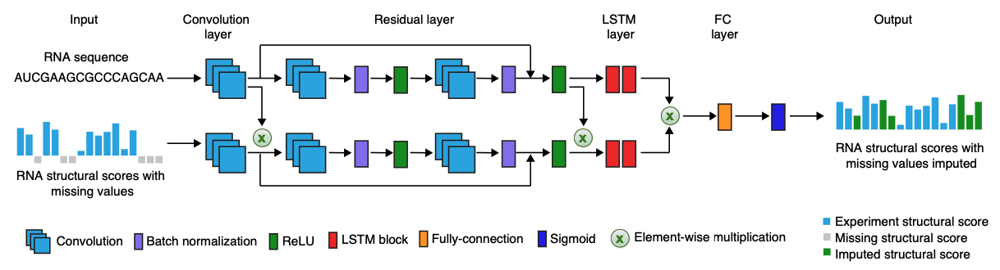

# StructureImpute
Deep learning based imputation of RNA secondary structure profile.

##  Architecture of StructureImpute model




## Installation


### Requirements

* torch>=1.1.0
* tensorboardX>=1.8
* nested_dict>=1.61
* pyfasta>=0.5.2
* matplotlib>=2.2.2
* seaborn>=0.9.0
* scikit-learn>=0.21.2

First clone the repository

```
git clone https://github.com/Tsinghua-gongjing/StructureImpute.git
```

Then install the required packages:

```
cd StructureImpute
pip install -r requirements.txt
pip install -e .
```

## Datasets


### Download pre-processed training set


You can directly download the pre-processed training set (data_processed_icSHAPE.tgz and data_processed_DMSseq.npz files) from [figshare](https://doi.org/10.6084/m9.figshare.16606850) or Tsinghua cloud:

```
cd StructureImpute

# 3.9GB
wget -c https://cloud.tsinghua.edu.cn/f/a2f50d3cf63044339600/?dl=1 -O data_processed_icSHAPE.tgz
MD5 (data_processed_icSHAPE.tgz) = 076c52aa48cbe3b5260297225907a5be

# 3.6GB
wget -c https://cloud.tsinghua.edu.cn/f/32dc9c895d6748479976/?dl=1 -O data_processed_DMSseq.tgz
# MD5 (data_processed_DMSseq.tgz) = 87133f4c51bc968a62710987b8f4df3a

tar zxvf data_processed_icSHAPE.tgz data_processed_DMSseq.tgz
```

The pre-processing pipeline is [data/README.md](data/README.md).

## Instructions


### Download meta model

You can directly download the pre-trained meta model (model_icSHAPE.pt and model_DMSseq.pt files) from [figshare](https://doi.org/10.6084/m9.figshare.16606850)

### Train a model

To train a model from scratch, run

```
exp/icSHAPE_hek293_ch/train_from_scratch.sh
```

To tune the training parameter by modifing the options `exp/icSHAPE_hek293_ch/train.sh`, show all the options by: 

```
python tools/main.py -h
```

Specific multi-GPU by:

```
CUDA_VISIBLE_DEVICES=0,1 exp/icSHAPE_hek293_ch/train.sh
```

Output files will be saved under the directory

* `log.txt`: the log file recording training process
* `model.pt`: the final saved model
* `prediction.txt`: the prediction result of validation set with the saved model

### Impute with the trained model

1. the prediction for a fragment file (e.g., data/structure_score/icSHAPE_hek_vivo.val) can be done by running `tools/main.py` with parameter `--predict` and `--filename_prediction`

```
python tools/main.py \
    --predict \
    --load_model /path/to/output/dir/prediction.pt \
    --filename_validation /path/to/fragment/file/will/be/imputed.txt \
    --filename_prediction /path/to/fragment/file/for/saved/imputed.txt \
```

2. for a new icshape.out file, use the script `structureimpute/explore/predict_new_icshape.py`. A new directory `/path/to/new/icshape.out.predict` will be created and save all the bootstrapping results:

```
python structureimpute/explore/predict_new_icshape.py --icshape /path/to/new/icshape.out \
	--predict_model /path/to/output/dir/prediction.pt
```

### Fine-tune on DMSseq data

Using the `--finetune` option to fine-tune on specific data with pre-trained model (`data/pretrained.pt`).
```
exp/DMSseq_K562_vivo/train.sh
```


## Copyright and License

This project is free to use for non-commercial purposes - see the [LICENSE](https://github.com/Tsinghua-gongjing/StructureImpute/blob/master/LICENSE) file for details.

## Reference

Gong, Jing; Xu, Kui; Zhang, Qiangfeng Cliff (2021): A deep learning method for recovering missing signals in transcriptome-wide RNA structure profiles from probing experiments. figshare. Dataset. https://doi.org/10.6084/m9.figshare.16606850

